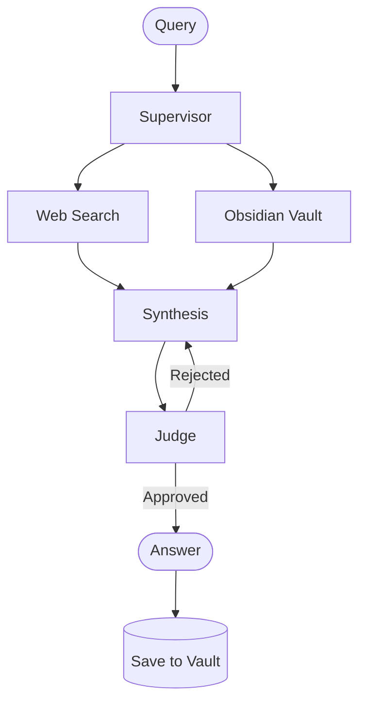

# Nexus

Personal research tool I built for myself. You ask a question, it searches the web and your Obsidian notes at the same time, and gives you one synthesized answer with sources.

The Obsidian part is what makes it worth using over just Googling something. As you save research and take notes, future queries pull from your own knowledge base alongside the web. It compounds.

## Architecture

I built this around the same multi-agent pattern showing up in enterprise AI tools — supervisor routes the request, specialized agents handle retrieval, a judge reviews the answer before it ships.



- **Supervisor** — figures out what to search for, generates a few varied queries
- **Web Search** — hits Tavily in parallel, deduplicates results
- **Docs Agent** — scores every `.md` file in your vault by keyword relevance, pulls the best excerpts
- **Synthesis** — combines everything into a structured answer, streams token by token
- **Judge** — separate LLM call that checks the answer before it reaches you. If it finds issues it sends it back once for revision.

When you save a result, it generates a note title, auto-tags it, and adds `[[wikilinks]]` to related notes already in your vault.

## Stack

- Backend: Python, FastAPI, Anthropic SDK, Tavily
- Frontend: React, Vite, Tailwind
- Storage: SQLite for history, Obsidian vault for notes
- Streaming: SSE for real-time agent updates

## Setup

You'll need an [Anthropic API key](https://console.anthropic.com) and a [Tavily API key](https://tavily.com) (free tier is fine). [Obsidian](https://obsidian.md) is optional but the point.

```bash
# Backend
cd backend
pip install -r requirements.txt
cp .env.example .env
# add your keys to .env
uvicorn main:app --reload --port 8000

# Frontend
cd frontend
npm install
npm run dev
```

Open `http://localhost:5173`. Point the vault path at your Obsidian folder in Settings and you're good.
